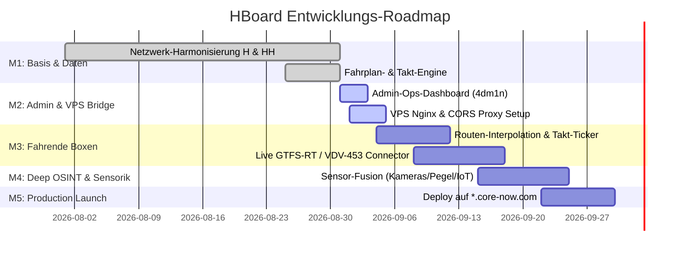

# 🧭 HBOARD OSINT & REAL-TIME TRAFFIC ENGINE — SYSTEM ROADMAP

> **Status**: Aktiv in Entwicklung  
> **Ziel-Infrastruktur**: VPS Reverse Proxy via Subdomain `*.core-now.com`  
> **Final Goal**: Live interpolierte, fahrende Fahrzeug-Boxen (Busse, Stadtbahnen, U-/S-Bahnen, Fähren) auf den OSM-Gleisen/Strecken beider Metropolen (Hannover & Hamburg).

---

## 🎯 Meilenstein-Übersicht

---

## 📌 Detaillierte Meilensteine

### 🟢 Meilenstein 1: Bereinigung & Datenharmonisierung (COMPLETED)
- [x] **Hannover Datensatz**: Alle Stadtbahnlinien (1, 3, 4, 5, 6, 10) & S-Bahn S4 mit 100% Haltestellenfolge.
- [x] **Hamburg Datensatz**: U-Bahnen (U1, U2, U3, U4), S-Bahnen (S1, S2, S3, S5) und HADAG-Fähren (61, 62, 72) mit vollständigen Geokoordinaten und Taktminuten.
- [x] **Reaktives Abfahrtsboard**: Dynamische Berechnung fahrplangenauer Abfahrtsminuten je Haltestellen-Offset (Wohltorf vs. Reinbek etc.).
- [x] **Karteninteraktion**: Klick auf Haltestelle öffnet Pop-up und fokussiert Kamera ohne störende Geister-Marker/Flaggen.

### 🟡 Meilenstein 2: Admin-Ops-Maske & VPS-Bridge (IN PROGRESS)
- [x] **Admin-Dashboard (`AdminDashboardModal.tsx`)**:
  - Passwort-Schutz (Standard: `4dm1n`, änderbar im UI & gespeichert im LocalStorage).
  - Meilenstein- & Fortschritts-Tracker.
  - Dataset-Inspektor für Hannover & Hamburg (Vollständigkeitsprüfung, Node-Counts).
  - API-Health & Latency Monitor (HAFAS, Overpass, PegelOnline, Autobahn, OpenSenseMap).
- [ ] **VPS & Subdomain-Konfiguration (`*.core-now.com`)**:
  - Bereitstellung einer Nginx-Konfiguration mit Reverse Proxy (`/api/transport`, `/api/gtfs`, `/api/overpass`).
  - Vollständige Umgehung von Browser-CORS-Restriktionen und Rate-Limits.

### 🔵 Meilenstein 3: Live Vehicle Engine — „Fahrende Boxen“ (UPCOMING)
- [ ] **Polylinien-Interpolations-Engine**:
  - Berechnung der Live-Fahrzeugpositionen anhand der aktuellen Taktzeit und Strecken-Polyline.
  - Glatte Bewegung interpolierter Marker entlang der Schienen / Wasserwege mit Richtungswinkel (Bearing/Heading).
- [ ] **Fahrzeug-Karten-Layer**:
  - Stilisierte Miniatur-Boxen im OSINT-Look mit Linien-Badge (z. B. `[6]`, `[U3]`, `[S2]`, `[62]`).
  - Klick auf eine fahrende Box öffnet Fahrzeug-Telemetrie (nächster Halt, Verspätung, Kurs, Geschwindigkeit).
- [ ] **GTFS-RT / Realtime-Feed Ingestion**:
  - Integration von GTFS-Realtime (Hamburg HVV Open Data / Hannover GVH).

### 🟣 Meilenstein 4: Deep OSINT & Sensor-Fusion
- [ ] Multi-Layer Overlay (Live-Verkehrskameras, Wasserpegel Elbe/Leine, LoRaWAN IoT Feinstaub).
- [ ] Automatische Vorfallserkennung (Staukorrelation mit ÖPNV-Verzögerungen).

### ⚪ Meilenstein 5: Production Deployment
- [ ] SSL/TLS über Let's Encrypt auf `.core-now.com`.
- [ ] Docker-Containerisierung (Frontend + Nginx Reverse Proxy).

---

## 📊 Datensatz-Inventar (Stand: 2026-08-31)

| Stadt | Datensatz | Umfang | Status |
| :--- | :--- | :--- | :--- |
| **Hannover** | Stadtbahn- & S-Bahn-Linien | 7 Linien (1, 3, 4, 5, 6, 10, S4) | ✅ 100% vollständig |
| **Hannover** | Haltestellen-Katalog | 68 Kernstationen mit GPS-Fix | ✅ Synchron |
| **Hannover** | Fahrpläne & Taktfolge | Alle Stammstrecken A, B, C, D, S | ✅ Synchron |
| **Hamburg** | Schnellbahn- & Fährlinien | 11 Linien (U1-U4, S1-S3, S5, F61, F62, F72) | ✅ 100% vollständig |
| **Hamburg** | Haltestellen-Katalog | 88 Kernstationen inkl. HADAG Anleger | ✅ Synchron |
| **Hamburg** | Fahrpläne & Taktfolge | Alle U-, S- und Fähr-Korridore | ✅ Synchron |
| **National** | Autobahn Webcams & Meldungen | A2, A7 (H), A1, A7, A23, A24 (HH) | ✅ Aktiv via OAPI |
| **OSINT** | Overpass Turbo Presets | 8 Live-Kataloge (KritIs, Sirenen, Bunker etc.) | ✅ Aktiv |
